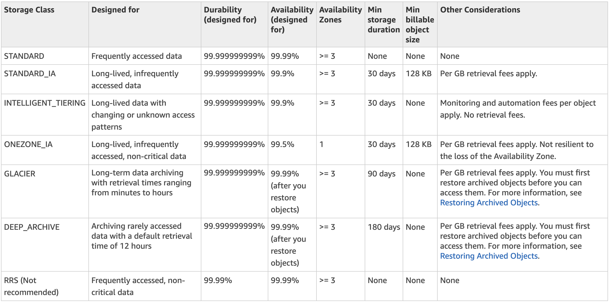

# Simple Storage Service (S3)

- S3 is object-based storage, it allows you to store files (up to 5TB) in buckets.
- S3 bucket has a **universal namespace**. Each bucket name has to be unqiue in its availablity zone (AZ).
    - S3 bucket name has to be beween 3 and 63 characters long;
    - S3 bucket name can only contain lower-case letters, numbers, dots and dashes;
    - S3 bucket name must start with a lower-case letter or number.
- S3 returns HTTP code `200` if file is uploaded sucessfully.
- Each object stored in S3 consists of
    - Key (i.e., file name)
    - Value (i.e., file content)
    - Version ID
    - Metadata
    - Access control list (ACL)
    - Torrent
- S3 ensures **read-after-write consistency** for `POST` requests (i.e., to add new files although AWS calls them new `PUT`s), while it only guarantees **eventual consistency** for `PUT` and `DELETE` requests.
    - If you use cross-region replication for your S3 buckets, the changes may not be reflected until the operation is fully propagated to all replicas.
- It is possible to enable MFA for `DELETE` requests.
- It is also possible to turn on _server access logging_.
    - The log can be sent to another bucket belonging to the same or a different account.
- The pricing model of S3 is calculated based on the storage size + data transfer cost.
    - The price for the storage size is different for different tiers;
    - The price for data transfer:
        - Data transfer into S3 is generally free (although `PUT`, `POST`, `HEAD` requests do carry a small cost);
        - Data transfer out of S3 is charged when you go beyond the free tier;
        - Data transfer from S3 to CloudFront is currently free;
        - Data transfer between S3 and EC2 (within the same region) is currently free.
- By default, you can only create up to 100 buckets per AWS account.
    - But you can increase this limit to 1000 by submitting a service limit increase.
- When an S3 bucket is used for static website hosting, it is possible to redirect requests for an object to another object in the same bucket or an external URL.
- AWS used to request S3 customers to have randomized prefixes for object names to achieve faster performance (for better sharding). However, this is not the case any more since [July 2018](https://aws.amazon.com/about-aws/whats-new/2018/07/amazon-s3-announces-increased-request-rate-performance/?nc1=h_ls).

## S3 Tiering

There are different tiers of S3 buckets and the comparison between them is presented in the table below:

- Compared with _S3 Standard_ class, _S3 IA_ and _S3 One-zone IA_ offers the same durability of 99.999999999%.
    - _S3 IA_ and _S3 One-zone IA_ offers the same high-throughput and low-latency feature as _S3 Standard_;
    - Being _less frequently accessed_ does not mean the access for them would be slower. The only tradeoff is an additional retrieval fee;
    - _S3 IA_ and _S3 One-zone IA_ requires each object to have a minimum size of 128KB. Objects will still be treated (and charged) as 128KB if smaller than 128KB.
- Compare with _S3 Standard_ and _S3 IA_ class, _S3 One-zone IA_ offers a slightly lower availability of 99.5%.
- Compared with _S3 Standard_ class, S3 Reduced Redundancy Storage (RRS) offers a much lowwer durability of 99.99%, but offers the same availablity of 99.99%.
    - It is not recommended to use S3 RRS for new projects in some regions.
- Usually, the _first-byte latency_ for _S3 Glacier_ would be 3 - 5 hours. However, AWS does provide different retrieval options, from a few minutes to hours:
    - **Expedited retrieval:** access data in 1 - 5 minutes, for occasional urgent requests to retrieve a subset of archives, costing $0.03 per GB retrieved;
    - **Standard retrieval:** access data in 3 - 5 hours, costing $0.01 per GB retrieved;
    - **Bulk retrieval:** access large amount of data in 5 - 12 hours, costing $0.0025 per GB retrieved.
- The _first-byte latency_ for _S3 Glacier Deep Archive_ would be within 12 hours.

## Security & Encryption

- Access control to an S3 bucket can be managed using either a bucket ACL or a bucket policy.
- By default, all newly created buckets are _private_.
- There are 3 approaches to achieve encryption for your interaction with S3 buckets:
    - **Encryption in transit:** using SSL/TLS (or HTTPS);
    - **Server-side encryption (encryption at rest):** the key could be from
        - S3 managed keys (also known as _SSE-S3_); or
        - AWS key management service (also known as _SSE-KMS_); or
        - Customer provided keys (also known as _SSE-C_);
    - **Client-side encryption:** the data would be encrypted before sent out.

## Versioning & Lifecycle

- Using **versioning** with S3 could be used to backup data (similar to any VCS).
    - It stores all versions of an object (all writes + delete marker).
- Once _enabled_, versioning cannot be _disabled_. It can only be _suspended_.
- Versioning can be integrated to lifecycle rules to optimize the size of the data stored.
    - Similar to the eviction policy (such as LFU or LRU) for Redis cache.
- MFA delete can only be used when versioning is enabled.
    - If a bucket's versioning configuration is MFA Delete–enabled, the bucket owner must include the `x-amz-mfa` header in requests to permanently delete an object version or change the versioning state of the bucket;
    - All authorized IAM users can enable versioning, but only the bucket owner can enable MFA Delete.
- **Lifecycle** automates moving your objects between different storage classes.
    - It can be used in conjuction with versioning;
    - It can be applied to current version and/or previous versions.

## Replication & Acceleration

- If you turn on **cross-region replication**, changes to objects in one bucket will be automatically propagated to another bucket for faster retrieval & disaster recovery purposes.
    - Replication can be done for the whole bucket or object-based with certain prefixes or tags only;
    - Versioning must be enabled on both _source bucket_ and _destination bucket_;
    - Files which are existing in a bucket when replication is turned on are not replicated automatically. However, subsequent updates to these files would be replicated;
    - Delete markers are not replicated;
    - Deletion of individual versions or delete markers (manually) would not be replicated;
    - **Cross-region replication** does not support chaining. In other words, it will not work if the source bucket is replicated from another bucket.
    - It is also impossible to **cross-region replicate** buckets encrypted with _SSE-C_.
- **Transfer acceleration** takes advantage of _CloudFront_. Data arrived at edge locations will be routed to S3 over an optimized network path.

## References

- [Consistency model](https://en.wikipedia.org/wiki/Consistency_model)
- [AWS S3 Documentation - Data Consistency Model](https://docs.aws.amazon.com/AmazonS3/latest/dev/Introduction.html#ConsistencyModel)
- [AWS S3 Documentation - Storage Classes](https://docs.aws.amazon.com/AmazonS3/latest/dev/storage-class-intro.html#sc-compare)
